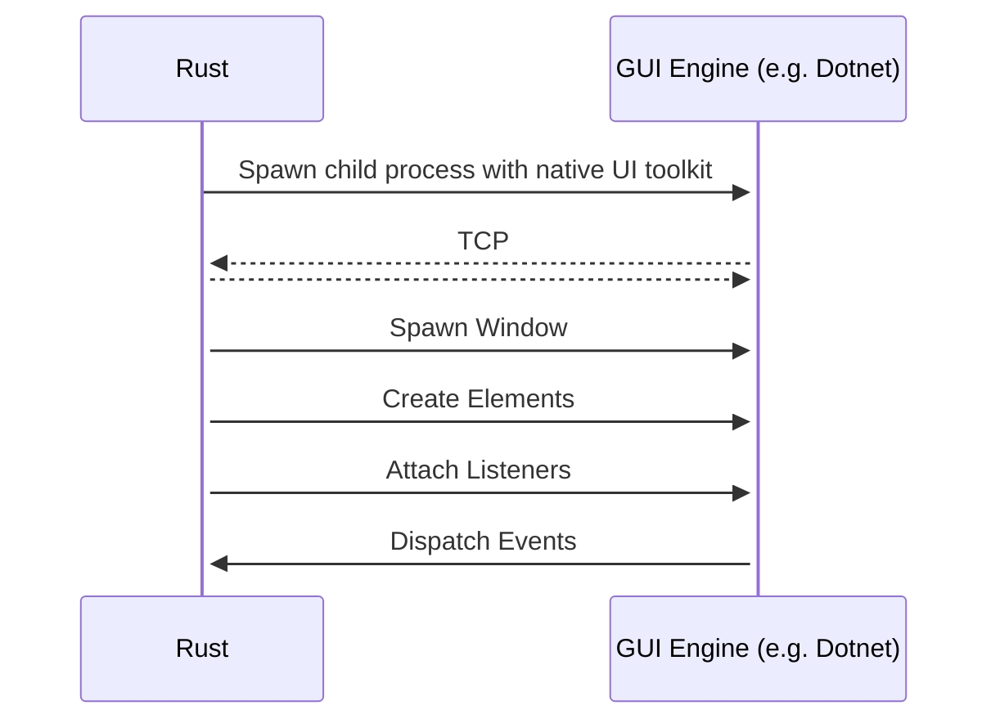

# Crayon (TODO)

Cross platform UI Toolkit for making native desktop applications.

This project aims to build a wrapper on top of platform-native UI toolkits written in their native languages to allow for the creation of desktop applications that look/feel idiomatic to the platform.

The Rust client syntax is modeled after web APIs and is intended to be a low-ish level API that "frameworks" can be built on top of - much like is the case with the Web world

```rust
use crayon::Window;
use crayon::Button;

fn main() {
    let window = Window::new(WindowOptions {
        ..Default::defaut()
    });

    let mut button = Button::new();

    button.set_inner_text("Click Me");
    button.styles.background_color.set("black");
    button.styles.color.set("white");

    button.add_event_listener("click", |_| async {
        println!("Clicked");
    });

   window.body.append_child(button);
   window.launch();
}
```

Elements can be created using macros

```rust
use crayon::Window;
use crayon::Button;

fn main() {
    let window = Window::new(WindowOptions {
        ..Default::defaut()
    });

    window.body.append_child(create_element!(
        <button
            styles.background_color={"black"}
            styles.color={"white"}
            onclick={|_| async { println!("Clicked") }}>
            Click Me!
        </button>
    ));

    window.body.append_child(button);
    window.launch();
}
```

This will work by having two components.

**Gui Engine**

A standalone application (binary) written with the platform's native GUI toolkit and in the platform's preferred language.

This binary exposes an API (probably TCP & JSON) to trigger the building of a UI from a client.

A GUI Engine would need to be produced for each supporting underlying GUI (Windows via Dotnet, MacOS via Cocao, Linux w Gnome via GTK4/Libatwaita, Linux w KDE via QT).

Each engine implementation would map an API contract back to their respective native APIs. This allows for extensibility, as new engines could be added and existing applications can take advantage of them without changes. 

**Library** 

A consumer library (Rust) that wraps the API from the GUI engine in an ergonomic library.

This library could either embed the Gui Engine or communicate with an external Gui Engine daemon process.

The library is not needed for the GUI Engine to work, it's just an ergonomic wrapper. You should, in theory, be able to produce a client library in any language that can work with TCP & JSON.

The library would spawn the GUI Engine as a child process and communicates with to facilitate building a GUI.


